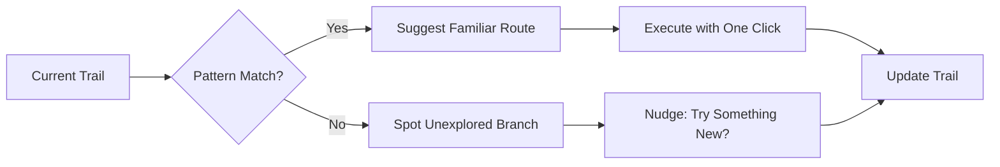

# Creator Trail Ontology Log (Olog)

> **Core Thesis**: Every time a creator works, they leave behind a *trail* of data. Trail-aware tools watch this trail in real time and adapt to how that person actually works.

---

## Ontology Structure

```
┌─────────────────────────────────────────────────────────────────────────────┐
│                        DIGITAL CONTENT CREATION                              │
├─────────────────────────────────────────────────────────────────────────────┤
│                                                                              │
│   ┌─────────────┐          generates           ┌─────────────────────┐      │
│   │   CREATOR   │ ─────────────────────────▶   │    CREATOR TRAIL    │      │
│   └─────────────┘                              └─────────────────────┘      │
│         │                                               │                    │
│         │ uses                                          │ contains           │
│         ▼                                               ▼                    │
│   ┌─────────────┐          observes            ┌─────────────────────┐      │
│   │    TOOL     │ ◀────────────────────────────│  TRAIL COMPONENTS   │      │
│   └─────────────┘                              └─────────────────────┘      │
│         │                                               │                    │
│         │ becomes                                       ├── Artifacts        │
│         ▼                                               ├── Metadata         │
│   ┌─────────────────┐      adapts to           │       └── Decisions        │
│   │  TRAIL-AWARE    │ ◀────────────────────────┘                            │
│   │     TOOL        │                                                        │
│   └─────────────────┘                                                        │
│         │                                                                    │
│         │ supports                                                           │
│         ▼                                                                    │
│   ┌─────────────────┐                                                        │
│   │ CREATIVE INTENT │                                                        │
│   └─────────────────┘                                                        │
│                                                                              │
└─────────────────────────────────────────────────────────────────────────────┘
```

---

## Formal Ontology Mappings

### Objects (Types)

| Symbol | Type | Description |
|--------|------|-------------|
| `C` | Creator | A person producing digital content |
| `T` | Trail | The evolving history of a creator's process |
| `A` | Artifact | Drafts, versions, clips, exports |
| `M` | Metadata | Timestamps, tags, analytics, annotations |
| `D` | Decision | Edits, choices, branches, undos |
| `S` | Tool | Any software used in creation |
| `S*` | Trail-Aware Tool | A tool designed around trail data |
| `P` | Pattern | Recurring behavior extracted from trail |
| `I` | Intent | The creator's goals, style, and vision |

### Morphisms (Relationships)

```
generates : C → T
    "A creator generates a trail through their actions"

contains : T → {A, M, D}
    "A trail contains artifacts, metadata, and decisions"

observes : S* → T
    "A trail-aware tool observes the creator trail in real time"

infers : S* × T → P
    "A trail-aware tool infers patterns from trail data"

adapts : S* × P → S*
    "The tool adapts its features and UI based on patterns"

supports : S* → I
    "The adapted tool supports creative intent without taking control"
```

---

## Trail Data Typology

### 1. Intermediate Artifacts
> Things created *during* the process

| Example | Domain |
|---------|--------|
| Draft cuts | Video Editing |
| Scene layouts | Streaming |
| Prototype builds | Game Dev |
| Version history | All |

### 2. Process Metadata
> Data *about* the process

| Example | Domain |
|---------|--------|
| Edit timestamps | Video Editing |
| Scene switch logs | Streaming |
| Build metrics | Game Dev |
| Session duration | All |

### 3. Decision Records
> Choices and their context

| Example | Domain |
|---------|--------|
| Cut vs. keep | Video Editing |
| Overlay triggers | Streaming |
| Feature toggles | Game Dev |
| Undo/redo chains | All |

---

## Evolution of Trail Usage

```
LEVEL 0 ─────────────────────────────────────────────────────────────────────
  TRAILS AS INVISIBLE EXHAUST
  
  • Tool logs data
  • Data goes to researchers/analysts
  • Creator never sees it
  • Tool behavior: STATIC
  
LEVEL 1 ─────────────────────────────────────────────────────────────────────
  TRAILS AS FEATURES
  
  • Version history
  • Undo trees
  • Analytics dashboards
  • Specific features use trail data
  • Tool behavior: PARTIALLY ADAPTIVE
  
LEVEL 2 ─────────────────────────────────────────────────────────────────────
  TRAILS AS BACKBONE (PROPOSED)
  
  • Architecture built around trail observation
  • Continuous pattern inference
  • Dynamic UI/feature adaptation
  • Creator maintains control
  • Tool behavior: FULLY ADAPTIVE
```

---

## Pattern Recognition Schema

When a trail-aware tool observes repeated sequences:

```
OBSERVATION                           INFERENCE
─────────────────────────────────────────────────────────
[Clutch Win] →                        Pattern: "HYPE_ROUTINE"
  → Mark clip                         
  → Switch to HYPE overlay            Trigger: Game event (big win)
  → Shout out donors                  Actions: [clip, overlay, alerts]
                                      
[Game Change] →                       Pattern: "TRANSITION_ROUTINE"
  → BRB screen                        
  → Swap tags                         Trigger: Game quit/switch
  → Tweak audio                       Actions: [BRB, tags, audio]
```

**Result**: Tool offers one-click execution of recognized patterns.

---

## Design Principles

### DO ✓

| Principle | Implementation |
|-----------|----------------|
| **Observe** | Continuously track trail in real time |
| **Infer** | Find patterns without requiring manual setup |
| **Suggest** | Offer helpful automations, don't force them |
| **Learn** | Update patterns when creator corrects/overrides |
| **Respect** | Keep creator in control at all times |

### DON'T ✗

| Anti-Pattern | Risk |
|--------------|------|
| **Cage creativity** | Over-relying on past patterns stifles experimentation |
| **Surveil creators** | Using trail data without transparency or consent |
| **Remove agency** | Automating without clear override mechanisms |
| **Homogenize style** | Pushing creators toward "average" patterns |

---

## Future Directions



**Key Insight**: Trail-aware tools should not only help creators *continue* their patterns, but also help them *break* patterns deliberately when desired.

---

## References

- **Domain**: Digital Content Creation, HCI, Creativity Support Tools
- **Key Concept**: "Process data as first-class design material"
- **Application Areas**: Live Streaming, Video Editing, Game Development
