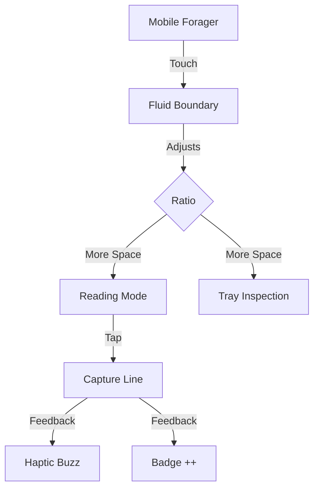

# Rocky Forager Trail Awareness Olog

> **Core Thesis**: Research is not just reading; it is a manufacturing process that leaves a trail of *transcluded* material. A trail-aware foraging tool treats every collected fragment as a permanent pointer back to its original context, allowing "Frankenstein" documents to be stitched together while retaining their full material history.

---

## Ontology Structure

```
┌─────────────────────────────────────────────────────────────────────────────┐
│                             FORAGING  PROCESS                               │
│                                                                             │
│   ┌─────────────┐           mines              ┌─────────────────────┐      │
│   │   FORAGER   │ ─────────────────────────▶   │      RAW DOCS       │      │
│   │  (The User) │                              └─────────────────────┘      │
│   └─────────────┘                                         │                 │
│         │                                                 │ contains        │
│         │ selects                                         ▼                 │
│         ▼                                      ┌─────────────────────┐      │
│   ┌─────────────┐          transcludes         │        LINES        │      │
│   │    TRAY     │ ◀─────────────────────────── │      (Atoms)        │      │
│   └─────────────┘                              └─────────────────────┘      │
│         │                                                 │                 │
│         │ sinters                                         │ points_back_to  │
│         ▼                                                 │                 │
│   ┌─────────────┐                                         │                 │
│   │    PAPER    │ ────────────────────────────────────────┘                 │
│   └─────────────┘                                                           │
│                                                                             │
└─────────────────────────────────────────────────────────────────────────────┘
```

---

## Formal Ontology Mappings

### Objects (Types)

| Symbol | Type | Description |
|--------|------|-------------|
| `F` | Forager | The researcher/user operating the system |
| `D` | Document | A raw markdown source file (read-only) |
| `L` | Line | The atomic unit of thought (one block of text) |
| `B` | Brick | A visual representation of a document in the grid |
| `T` | Tray Item | A collected fragment, mutable but linked to source |
| `P` | Paper | The linear output synthesized from Tray Items |
| `H` | Heatmap | Visual density of collection per Document |

### Morphisms (Relationships)

```
mines : F → D
    "A forager mines raw documents for value"

contains : D → {L}
    "A document contains a set of ordered lines"

selects : F × L → T
    "A forager selects a line to create a tray item"

links_to : T → L
    "A tray item permanently links back to its source line"

sinters : F × {T} → P
    "A forager sinters multiple tray items into a cohesive paper"

visualizes : H → D
    "A heatmap visualizes the intensity of foraging on a document"
```

---

## Trail Data Typology

### 1. The Transclusion Trail
> **Everything is a pointer.**
When a line is collected, it is not *copied*; it is *transcluded*. The Tray Item (`T`) retains the DNA of its parent Document (`D`) and Line Index (`L`).
- **Input**: User clicks a line.
- **Data Stored**: `{ docId, lineIdx, originalText, userNotes }`
- **Output**: A "Frankenstein" paper where every sentence knows its mother.

### 2. The Heatmap Trail
> **Activity becomes topology.**
As the Forager works, the *infrastructure* changes color.
- **Observation**: "User has collected 15 items from *Negarestani_2018.md*."
- **Inference**: "This document is hot/central to the current thesis."
- **Adaptation**: The Document Brick turns **Red**.
- **Result**: The "reading list" becomes a "heat map" of intellectual labor.

### 3. The Mobile Trail
> **Foraging is peripatetic.**
The mobile interface is designed for "grazing"—quick, opportune collection of lines while away from the desk.
- **Constraints**: Small screen, touch interaction.
- **Adaptation**:
    - **Hide Title**: Prioritize content and controls (Gear, Tray).
    - **Touch Resizer**: Allow fluid reshaping of reading vs. collecting space.
    - **One-Thumb Collect**: Tapping a line instantly captures it.

---

## Mobile-Specific Ontology

On mobile devices, the relationship between `Forager` and `Interface` changes:



**Key Mobile Move**: The *Resizer* becomes the primary tool for shifting context between **Consumption** (Reading Pane) and **Synthesis** (Tray Pane). It is not just a UI element; it is a mode switch.

---

## Future Directions: The "Sintering" Engine

Currently, Rocky Forager is a **Collector**. The next phase is **Sintering**:
1.  **Auto-Clustering**: The Tray detects semantic similarity between items.
2.  **Gap Analysis**: The system notices Documents you *haven't* mined yet (`Heatmap == 0`) and suggests them.
3.  **Graph Export**: Export not just a linear paper, but a `.poml` graph of connected ideas.

---

## References

- **Nelson, Ted**: *Transclusion* (Literary Machines)
- **Bush, Vannevar**: *The Memex* (As We May Think)
- **Notion**: *Block-based editing*
- **Local-First Software**: *Data ownership and file:// protocol*
