# SINTERING REPORT v2: GAPS AND BUILDOUT

## What's Missing from v1

---

### 🔴 CRITICAL GAPS (Must Address)

#### Gap 1: Missing Foundational HCI Authors

The sinter claims HCI positioning but omits the core HCI theorists:

| Missing Author | Work | Why Critical |
|----------------|------|--------------|
| **Suchman** | Plans and Situated Actions (1987) | Scene = failed plan; void = situated resource |
| **Agre** | Computation and Human Experience (1997) | Indexical vs deictic = void vs scene EXACTLY |
| **Winograd & Flores** | Understanding Computers (1987) | Breakdown as design opportunity = void as generative |
| **Dourish** | Where the Action Is (2001) | Embodied interaction; context as achievement |
| **Latour** | Reassembling the Social (2005) | ANT; void as anti-black-box |
| **Bowker & Star** | Sorting Things Out (1999) | Infrastructure visibility; void as revealed infra |

**ACTION:** Add all six to "Must Cite" with explicit thesis mappings.

---

#### Gap 2: Missing Cognitive Load Literature

The thesis claims "cognitive cost exceeds benefit" but doesn't cite cognitive load theory:

| Missing Author | Work | Why Critical |
|----------------|------|--------------|
| **Sweller** | Cognitive Load Theory (1988) | Intrinsic vs extraneous load = essential vs accidental |
| **Paas & van Merriënboer** | Cognitive Load Measurement | Methods for measuring coherence bounds |
| **Miller** | Magical Number Seven (1956) | Classic bounded capacity |
| **Cowan** | Magical number 4 (2001) | Updated capacity limits |

**ACTION:** Add cognitive load as third theoretical pillar (alongside complexity and agency).

---

#### Gap 3: Missing Prompt Engineering Literature

The thesis applies to LLM collaboration but doesn't engage with prompt engineering research:

| Missing Work | Why Critical |
|--------------|--------------|
| **Wei et al.** Chain-of-Thought (2022) | Structured prompting as proto-void |
| **Kojima et al.** Zero-Shot CoT (2022) | "Let's think step by step" as void constraint |
| **OpenAI** System prompts documentation | Industrial practice of void definition |
| **Liu et al.** Prompt Engineering Survey (2023) | Systematic review of the field |

**ACTION:** Add prompt engineering section showing POML as void-first prompting.

---

#### Gap 4: Missing Computational Creativity

The thesis addresses creative AI but doesn't cite computational creativity:

| Missing Author | Work | Why Critical |
|----------------|------|--------------|
| **Colton** | Computational Creativity (2012) | Creator autonomy vs tool distinction |
| **Boden** | The Creative Mind (1990/2004) | Possibility spaces in creativity |
| **Jordanous** | Evaluating Creativity | Metrics for creative AI |

**ACTION:** Add computational creativity as domain parallel.

---

#### Gap 5: No Empirical Validation Design

The thesis is falsifiable but the sinter doesn't propose HOW to test it:

**Missing:**
- Experimental design for void vs scene comparison
- Metrics for "coherence collapse"
- User study protocol
- Longitudinal study design

**ACTION:** Add Section 9: Empirical Validation Roadmap.

---

### 🟡 STRUCTURAL GAPS (Should Address)

#### Gap 6: Missing Visual Citation Network

The report describes clusters but doesn't visualize them.

**ACTION:** Build actual Mermaid diagram of citation network.

---

#### Gap 7: Missing Related Work Section Draft

The sinter provides material but doesn't draft the actual paper section.

**ACTION:** Write 500-word Related Work draft ready for insertion.

---

#### Gap 8: Missing Terminology Table

The thesis introduces new terms but doesn't systematically define them vs existing terms.

**ACTION:** Create formal terminology mapping table.

---

### 🟢 EXTENSION OPPORTUNITIES (Could Address)

#### Extension 1: Contemporary LLM Papers (2024-2025)

Search for and integrate:
- Context window scaling research (Anthropic, OpenAI technical reports)
- Long-context evaluation benchmarks
- Multi-turn dialogue quality research

#### Extension 2: Design Pattern Literature

Map void/scene to software design patterns:
- Void = Factory pattern (defines creation interface without specifying concrete)
- Scene = Builder pattern (constructs complex object step by step)

#### Extension 3: Architecture/Urban Planning

Alexander's pattern language as void management:
- Pattern = named void with generative grammar
- Pattern language = system of composable voids

---

## BUILDOUT: MISSING SECTIONS

### Section A: Extended Foundational Citations

```
═══════════════════════════════════════════════════════════════════════════════
EXTENDED FOUNDATIONAL CITATIONS
═══════════════════════════════════════════════════════════════════════════════

SITUATED ACTION LINEAGE
-----------------------

1. Suchman, L. (1987/2007). Human-Machine Reconfigurations: Plans and 
   Situated Actions. Cambridge University Press.
   
   KEY QUOTE: "Plans are resources for action, not its determinants."
   
   THESIS TRANSLATION: 
   - Scene = the plan that tries to determine action
   - Void = the resource for situated action
   - Scene management fails because plans fail
   - Void management works because resources enable

2. Agre, P. (1997). Computation and Human Experience. Cambridge University Press.
   
   KEY DISTINCTION: Indexical vs Deictic Representation
   - Deictic: "Put the red block on the blue block" (absolute reference)
   - Indexical: "Put this on that" (relative reference)
   
   THESIS TRANSLATION:
   - Scene = deictic (absolute world model, must maintain completely)
   - Void = indexical (relative constraints, locally navigable)
   - Scene management requires complete world model
   - Void management requires only local constraint satisfaction

3. Winograd, T. & Flores, F. (1987). Understanding Computers and Cognition.
   
   KEY CONCEPT: Breakdown
   - Normal operation is "ready-to-hand" (transparent)
   - Breakdown makes tools "present-at-hand" (visible)
   - Breakdown is not failure but opportunity for design
   
   THESIS TRANSLATION:
   - Scene management hides breakdown (accumulated errors invisible)
   - Void management makes breakdown visible (constraints explicit)
   - "Complexity grey" = breakdown without visibility

4. Dourish, P. (2001). Where the Action Is: The Foundations of Embodied 
   Interaction. MIT Press.
   
   KEY CLAIM: Context is not a container but an achievement.
   
   THESIS TRANSLATION:
   - Scene management treats context as container (accumulate it)
   - Void management treats context as achievement (user creates it)
   - Context can't be pre-specified; it must be instantiated

5. Latour, B. (2005). Reassembling the Social. Oxford University Press.
   
   KEY CONCEPT: Black-boxing
   - Successful technologies become invisible (black-boxed)
   - Controversy opens the black box
   
   THESIS TRANSLATION:
   - Scene management black-boxes AI contribution
   - Void management keeps the void visible (anti-black-box)
   - Void is the visible seam in the system

6. Bowker, G. & Star, S. L. (1999). Sorting Things Out: Classification 
   and Its Consequences. MIT Press.
   
   KEY METHOD: Infrastructural Inversion
   - Make the invisible infrastructure visible
   - Reveal the work that makes systems work
   
   THESIS TRANSLATION:
   - Scene management is invisible infrastructure
   - Void management is infrastructural inversion
   - The void makes the infrastructure (prompt logic) visible
```

---

### Section B: Cognitive Load Integration

```
═══════════════════════════════════════════════════════════════════════════════
COGNITIVE LOAD THEORY INTEGRATION
═══════════════════════════════════════════════════════════════════════════════

THEORETICAL BRIDGE
------------------

Sweller (1988) distinguishes three types of cognitive load:

1. INTRINSIC LOAD: Inherent complexity of the material
   → Maps to: Essential complexity (Brooks)
   → Maps to: The problem's actual difficulty

2. EXTRANEOUS LOAD: Complexity added by presentation/process
   → Maps to: Accidental complexity (Brooks)
   → Maps to: Scene management overhead

3. GERMANE LOAD: Cognitive effort for schema construction
   → Maps to: Learning / skill acquisition
   → Maps to: Irrelevant to thesis (thesis is about work, not learning)

THESIS TRANSLATION:
- Scene management maximizes EXTRANEOUS load (accumulated context)
- Void management minimizes EXTRANEOUS load (bounded dimensions)
- Both have same INTRINSIC load (same problem)
- Users have bounded total capacity (Miller, Cowan)
- When extraneous exceeds capacity, coherence collapses

CITATIONS TO ADD:

Sweller, J. (1988). Cognitive Load During Problem Solving: Effects on 
Learning. Cognitive Science, 12, 257-285.

Paas, F., Tuovinen, J. E., Tabbers, H., & Van Gerven, P. W. (2003). 
Cognitive Load Measurement as a Means to Advance Cognitive Load Theory. 
Educational Psychologist, 38(1), 63-71.

Cowan, N. (2001). The Magical Number 4 in Short-Term Memory: A 
Reconsideration of Mental Storage Capacity. Behavioral and Brain 
Sciences, 24, 87-114.

INTEGRATION POINT:
The thesis's "complexity grey" = cognitive overload state where 
monitoring resources are exhausted and error detection fails.
```

---

### Section C: Prompt Engineering Connection

```
═══════════════════════════════════════════════════════════════════════════════
PROMPT ENGINEERING AS PROTO-VOID MANAGEMENT
═══════════════════════════════════════════════════════════════════════════════

ANALYSIS
--------

Chain-of-Thought (Wei et al., 2022) is proto-void management:
- CoT: "Let's solve this step by step"
- Translation: Defines a VOID (sequence of reasoning steps)
- User/model instantiates the steps
- Constraint: steps must connect
- Without CoT, model generates scene directly (often fails)

Zero-Shot-CoT (Kojima et al., 2022) is even clearer:
- Just adding "Let's think step by step" improves performance
- Why? It defines a void (thinking process) without specifying content
- The phrase is a void specification: dimension = steps, content = unspecified

System Prompts (OpenAI, Anthropic) are void definitions:
- "You are a helpful assistant" = identity void
- "You must not generate harmful content" = constraint dimension
- The system prompt is NOT content; it's the void's walls

POML as Void-First Prompting:
- POML encodes prompt LOGIC, not prompt OUTPUTS
- <role>, <task>, <rules> define void dimensions
- User query instantiates within those dimensions
- 1,374 lines of POML = 1,374 lines of void specification

KEY INSIGHT:
Prompt engineering literature is discovering void management empirically
without naming it. CoT, system prompts, structured output—all are void
management techniques. POML formalizes what prompting practice discovered.

CITATIONS TO ADD:

Wei, J., et al. (2022). Chain-of-Thought Prompting Elicits Reasoning in 
Large Language Models. NeurIPS 2022.

Kojima, T., et al. (2022). Large Language Models are Zero-Shot Reasoners. 
NeurIPS 2022.

Liu, P., et al. (2023). Pre-train, Prompt, and Predict: A Systematic 
Survey of Prompting Methods in Natural Language Processing. ACM Computing 
Surveys.

THESIS CLAIM:
"Prompt engineering is empirical void management. The field's best practices
(CoT, structured prompts, system messages) are void techniques without the
architectural framing. POML is an attempt to make the void explicit."
```

---

### Section D: Visual Citation Network

```mermaid
flowchart TD
    subgraph Classical["Classical Foundations (1956-1970)"]
        Miller56["Miller (1956)<br/>Magical Number 7"]
        Ashby56["Ashby (1956)<br/>Requisite Variety"]
        Simon62["Simon (1962)<br/>Architecture of Complexity"]
        Simon69["Simon (1969)<br/>Sciences of Artificial"]
    end

    subgraph Cognitive["Cognitive Science (1980s-2000s)"]
        Sweller88["Sweller (1988)<br/>Cognitive Load Theory"]
        Cowan01["Cowan (2001)<br/>Magical Number 4"]
    end

    subgraph SituatedAction["Situated Action (1980s-2000s)"]
        Suchman87["Suchman (1987)<br/>Plans & Situated Actions"]
        WF87["Winograd & Flores (1987)<br/>Breakdown"]
        Agre97["Agre (1997)<br/>Indexical/Deictic"]
        Dourish01["Dourish (2001)<br/>Embodied Interaction"]
    end

    subgraph Infrastructure["Infrastructure Studies"]
        BowkerStar99["Bowker & Star (1999)<br/>Infrastructural Inversion"]
        Latour05["Latour (2005)<br/>Black-boxing"]
    end

    subgraph Design["Design Theory"]
        Alexander77["Alexander (1977)<br/>Pattern Language"]
        Brooks87["Brooks (1987)<br/>Essential/Accidental"]
        SalenZimmerman03["Salen & Zimmerman (2003)<br/>Possibility Space"]
    end

    subgraph Values["Values in Design (2000s-2010s)"]
        Shilton13["Shilton (2013)<br/>Values Levers"]
        Friedman19["Friedman (2019)<br/>VSD"]
    end

    subgraph HCI_AI["HCI + AI (2019-2025)"]
        Horvitz99["Horvitz (1999)<br/>Mixed-Initiative"]
        Amershi19["Amershi et al. (2019)<br/>HAI Guidelines"]
        Shneiderman22["Shneiderman (2022)<br/>HCAI"]
        Howard24["Howard (2024)<br/>Context Degradation"]
    end

    subgraph Prompting["Prompt Engineering (2022-2025)"]
        Wei22["Wei et al. (2022)<br/>Chain-of-Thought"]
        Kojima22["Kojima et al. (2022)<br/>Zero-Shot CoT"]
    end

    subgraph THESIS["VOID MANAGEMENT THESIS"]
        VM["Void Management<br/>Architecture"]
    end

    %% Connections to thesis
    Simon62 --> VM
    Brooks87 --> VM
    Suchman87 --> VM
    Agre97 --> VM
    Sweller88 --> VM
    BowkerStar99 --> VM
    Shneiderman22 --> VM
    Howard24 --> VM
    Wei22 -.-> VM

    %% Internal connections
    Simon62 --> Suchman87
    Simon62 --> Brooks87
    Suchman87 --> Agre97
    Agre97 --> Dourish01
    Miller56 --> Sweller88
    Miller56 --> Cowan01
    Horvitz99 --> Amershi19
    Amershi19 --> Shneiderman22
    Alexander77 --> SalenZimmerman03
    WF87 --> Dourish01
    BowkerStar99 --> Shilton13
```



---

### Section E: Related Work Draft (500 words)

```
═══════════════════════════════════════════════════════════════════════════════
RELATED WORK: DRAFT FOR PAPER
═══════════════════════════════════════════════════════════════════════════════

## 2. Related Work

Our work builds on three converging research streams: complexity and bounded 
rationality, situated action and representation, and human-AI collaboration 
guidelines.

### 2.1 Complexity and Bounded Rationality

Simon's foundational work on complexity (1962) introduced the concept of 
"near-decomposable" systems—complex wholes that can be understood through 
hierarchical decomposition. Brooks (1987) extended this to software, 
distinguishing essential complexity (inherent to the problem) from accidental 
complexity (introduced by the solution). Cognitive load theory (Sweller, 1988) 
provided the psychological mechanism: human working memory is bounded, and 
extraneous cognitive load reduces capacity for essential problem-solving.

Our void/scene distinction operationalizes these insights for AI collaboration. 
Scene management accumulates accidental complexity (each LLM response adds 
context that subsequent responses must account for), while void management 
bounds accidental complexity by fixing the dimensions of the possibility space. 
When extraneous load exceeds cognitive capacity, users enter what we call 
"complexity grey"—the state where distinguishing broken from designed becomes 
impossible.

### 2.2 Situated Action and Representation

The situated action tradition (Suchman, 1987; Agre, 1997; Dourish, 2001) 
critiques systems that attempt to maintain complete world models. Suchman 
argued that plans are resources for action, not determinants; Agre 
distinguished indexical representations (relative to the agent) from deictic 
representations (absolute world models), showing that indexical approaches 
scale better.

Our scene/void distinction maps directly to Agre's deictic/indexical contrast. 
Scene management requires a deictic approach—maintaining the complete 
conversation state to modify any part. Void management is indexical—defining 
local constraints that users navigate with situated judgment. The void 
preserves what Scott (1998) calls mētis: the practical, local knowledge that 
resists systematization.

### 2.3 Human-AI Collaboration Guidelines

Recent work on Human-Centered AI (Shneiderman, 2022) and human-AI interaction 
guidelines (Amershi et al., 2019) emphasizes human control and transparency. 
Amershi et al. validated 18 guidelines including "make clear what the system 
can do" and "make clear why the system did what it did." Shneiderman's 
two-dimensional framework positions ideal systems as high-automation and 
high-control.

Our contribution is architectural: void management provides the *mechanism* 
for achieving high-control, high-automation systems. The void's dimensions 
are explicit (satisfying transparency guidelines), and instantiation is human 
(satisfying control requirements). This extends the guidelines from single 
interactions to iterative collaboration with accumulating context.

### 2.4 Prompt Engineering and Structured Generation

Emerging work on prompt engineering (Wei et al., 2022; Kojima et al., 2022) 
has empirically discovered techniques—chain-of-thought prompting, system 
messages, structured outputs—that function as implicit void management. 
These techniques constrain the LLM's possibility space without specifying 
content. Our POML formalism makes this implicit void management explicit, 
encoding prompt *logic* rather than prompt *examples*.

---
[500 words]
```

---

### Section F: Empirical Validation Roadmap

```
═══════════════════════════════════════════════════════════════════════════════
EMPIRICAL VALIDATION ROADMAP
═══════════════════════════════════════════════════════════════════════════════

STUDY 1: CONTROLLED COMPARISON
------------------------------

Research Question: Do void-managed systems maintain coherence longer than 
scene-managed systems in iterative creative tasks?

Design: Within-subjects comparison
- N = 30 participants
- Task: Iterative story development (20 rounds)
- Condition A: Scene management (standard ChatGPT interface)
- Condition B: Void management (Thousand-Tetrad interface)
- Counterbalanced order

Measures:
- Primary: Coherence collapse point (round at which modification 
  unintentionally affects >3 elements)
- Secondary: Task completion rate, subjective satisfaction, perceived agency
- Control: Prior AI experience, creative writing ability

Prediction: Void condition will have significantly higher collapse threshold.

---

STUDY 2: LONGITUDINAL CASE STUDY
--------------------------------

Research Question: How do practitioners adapt to void management over time?

Design: Longitudinal multiple case study (n=5)
- 5 creative professionals using void-based tools for 4 weeks
- Daily diary entries
- Weekly semi-structured interviews
- Artifact collection

Analysis:
- Thematic analysis of adaptation patterns
- Episode analysis of breakdown moments
- Comparison of early vs late artifacts

---

STUDY 3: COGNITIVE LOAD MEASUREMENT
-----------------------------------

Research Question: Does void management reduce extraneous cognitive load?

Design: Experimental comparison with physiological measures
- N = 24 participants
- Task: Complex document editing with AI assistance
- Conditions: Scene vs void interface
- Measures: NASA-TLX, pupillometry, secondary task performance

Prediction: Void condition will show lower extraneous load (NASA-TLX mental 
demand subscale) without affecting intrinsic load.

---

OPERATIONALIZATION OF KEY CONSTRUCTS
-------------------------------------

"Coherence Collapse":
- Operational definition: Participant modifies element X, and >3 elements 
  (Y, Z, W...) unintentionally change
- Measurement: Diff analysis of before/after artifact states
- Threshold: 3 elements chosen based on Simon's near-decomposability

"Void" vs "Scene" Conditions:
- Scene: Standard conversational LLM interface with full history visible
- Void: Interface with explicit dimensional constraints, user-driven 
  instantiation, and bounded history

"Agency":
- Self-report: "I felt in control of the creative process" (7-point Likert)
- Behavioral: Ratio of user-initiated to AI-initiated changes
```

---

## SUMMARY: BUILD PRIORITY

| Priority | Gap | Action | Effort |
|----------|-----|--------|--------|
| 🔴 P0 | Missing foundational HCI | Add Suchman, Agre, Winograd, Dourish, Latour, Bowker | 1 hr |
| 🔴 P0 | Missing cognitive load | Add Sweller, Paas, Cowan integration | 30 min |
| 🔴 P0 | Missing prompt engineering | Add Wei, Kojima, Liu connection | 30 min |
| 🟡 P1 | No citation diagram | Create Mermaid network | 15 min |
| 🟡 P1 | No Related Work draft | Write 500-word section | 30 min |
| 🟡 P1 | No empirical design | Write study protocols | 1 hr |
| 🟢 P2 | Computational creativity | Add Colton, Boden | 20 min |
| 🟢 P2 | Contemporary LLM papers | Search 2024-2025 literature | 1 hr |

**Total to complete v2: ~5 hours of focused work**
